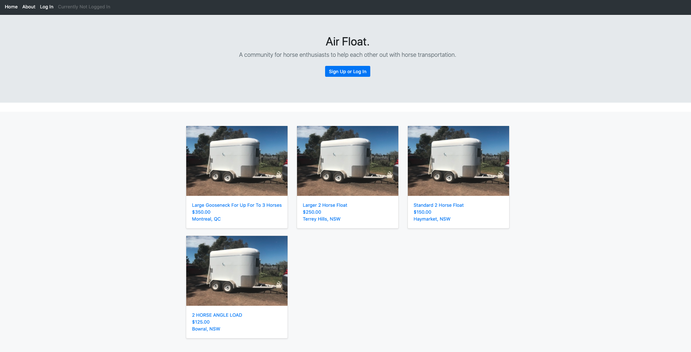
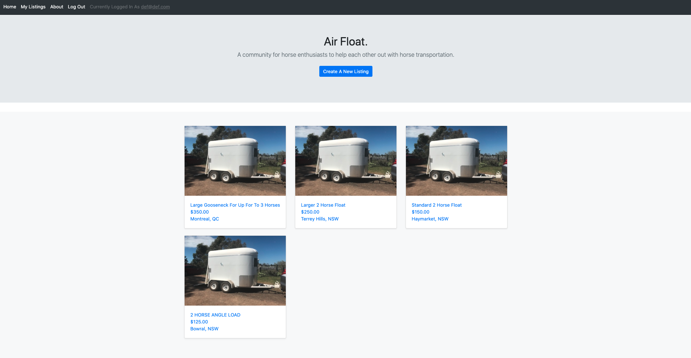
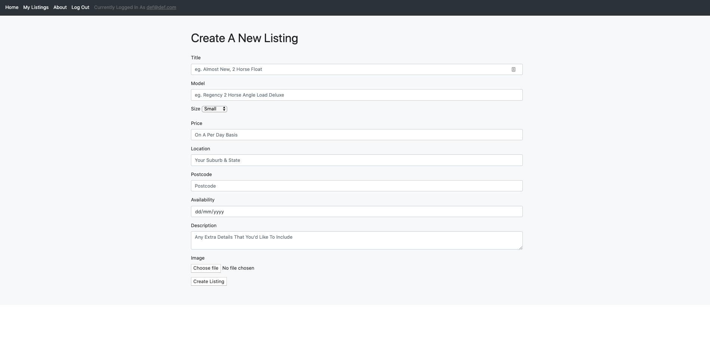
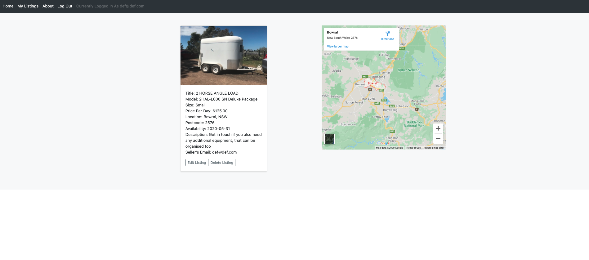
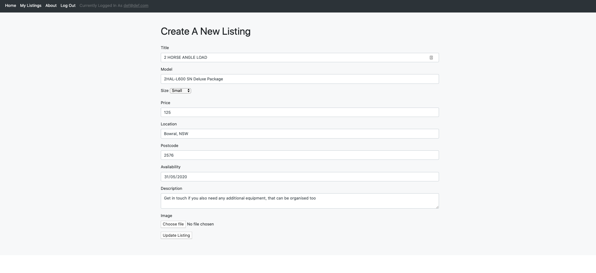
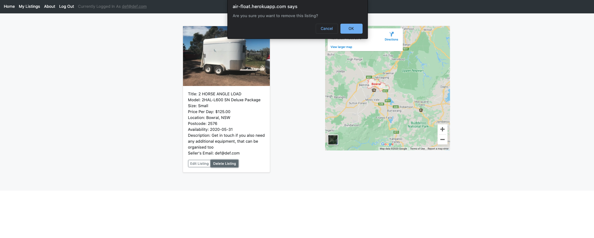

## T2A2 Marketplace Project - Ryan Cook

### R7 - Identification of the problem you are trying to solve by building this particular marketplace app.

Horse riding is a somewhat niche sport and leisure activity. According to Wikipedia, around 400,000 people in Australia ride horses, which makes out to be just over 1% of the population. Unfortunately, it can become quite expensive, especially when you're looking at transportation. You’re not often needing to transport your horse, but when you do, a new horse float starts on average at around AUD $20,000. For most, this is a lot of money to have invested in something that functionally sits there doing nothing for the majority of the time. This marketplace lets people who would otherwise not be able to afford or find horse transport, to have access at a lower price point, or access at all. It also provides a platform for owners of horse floats to generate some extra cash flow at times when they don’t need to use it for themselves.

Put simply, I'm connecting horse float owners with other horse enthusiasts who require the use of horse floats, for the betterment of the community.

### R8 - Why is it a problem that needs solving?

The main issue is accessibility - not being able to afford a horse float, or have anywhere to keep it (for example, apartment owners) shouldn’t mean that people don’t have access to one when required. It’s a small community, and floats are most often required for competitions (which many people from the same community will also be attending). As a result, there might not be one available in your small local community of riders. This opens up the possibility to connect with horse float owners from all over the city or region, who you would otherwise not be able to seek out and get in touch with. 

### R9 - A link (URL) to your deployed app (i.e. website)

```
https://air-float.herokuapp.com/
```

### R10 - A link to your GitHub repository (repo) - Ensure the repo is accessible by your Educators

```
https://github.com/theryancook/2-way-marketplace-rails
```

### R11 - Description of your marketplace app (website), including:
### - Purpose
### - Functionality / features
### - Sitemap
### - Screenshots
### - Target audience
### - Tech stack (e.g. html, css, deployment platform, etc)

#### Purpose
To have somewhere for people from the horse riding community to be able to find transport options for their horse when needed, as well as providing somewhere for horse float owners to generate some extra money while they’re not using their own float.

#### Functionality / features
User authentication - without being logged in, users are able to see the index of all the listings and summary information of those listings, but won’t be able to use any of the site functionality.

Logging in and signing up - users will then be able to see more detailed information on others listings, as well as being able to create their own listings. In the navigation bar, users can see which account they’re logged in as and a specific view of all their own listings.

Listings - Once the listing has been created, it can only be edited and deleted by the user who created the listing. If the current user is not the creator, that functionality is replaced by a payment link in order to rent the float.

Payments - Made through Stripe, fully integrated. Directs users back to the index automatically once the purchase has been authenticated by Stripe.

#### Sitemap


#### Screenshots













#### Target audience
Horse owners and riders, anyone who requires horse transportation.

#### Tech stack (e.g. html, css, deployment platform, etc)
* Ruby on Rails
* PostgreSQL
* Ruby
* HTML
* CSS
* Heroku
* AWS Simple Storage Service (S3)
* Stripe
* Bootstrap
* Goolgle Maps
* Gems: Devise


```
ActiveRecord::Schema.define(version: 2020_05_14_020731) do

  enable_extension "plpgsql"

  create_table "active_storage_attachments", force: :cascade do |t|
    t.string "name", null: false
    t.string "record_type", null: false
    t.bigint "record_id", null: false
    t.bigint "blob_id", null: false
    t.datetime "created_at", null: false
    t.index ["blob_id"], name: "index_active_storage_attachments_on_blob_id"
    t.index ["record_type", "record_id", "name", "blob_id"], name: "index_active_storage_attachments_uniqueness", unique: true
  end

  create_table "active_storage_blobs", force: :cascade do |t|
    t.string "key", null: false
    t.string "filename", null: false
    t.string "content_type"
    t.text "metadata"
    t.bigint "byte_size", null: false
    t.string "checksum", null: false
    t.datetime "created_at", null: false
    t.index ["key"], name: "index_active_storage_blobs_on_key", unique: true
  end

  create_table "listings", force: :cascade do |t|
    t.bigint "user_id"
    t.string "title"
    t.string "model"
    t.text "description"
    t.bigint "size_id"
    t.string "price"
    t.string "location"
    t.integer "postcode"
    t.date "availability"
    t.datetime "created_at", null: false
    t.datetime "updated_at", null: false
    t.index ["size_id"], name: "index_listings_on_size_id"
    t.index ["user_id"], name: "index_listings_on_user_id"
  end

  create_table "sizes", force: :cascade do |t|
    t.string "size"
    t.datetime "created_at", null: false
    t.datetime "updated_at", null: false
  end

  create_table "users", force: :cascade do |t|
    t.string "email", default: "", null: false
    t.string "encrypted_password", default: "", null: false
    t.string "reset_password_token"
    t.datetime "reset_password_sent_at"
    t.datetime "remember_created_at"
    t.datetime "created_at", null: false
    t.datetime "updated_at", null: false
    t.index ["email"], name: "index_users_on_email", unique: true
    t.index ["reset_password_token"], name: "index_users_on_reset_password_token", unique: true
  end

  add_foreign_key "active_storage_attachments", "active_storage_blobs", column: "blob_id"
  add_foreign_key "listings", "sizes"
  add_foreign_key "listings", "users"
end
```